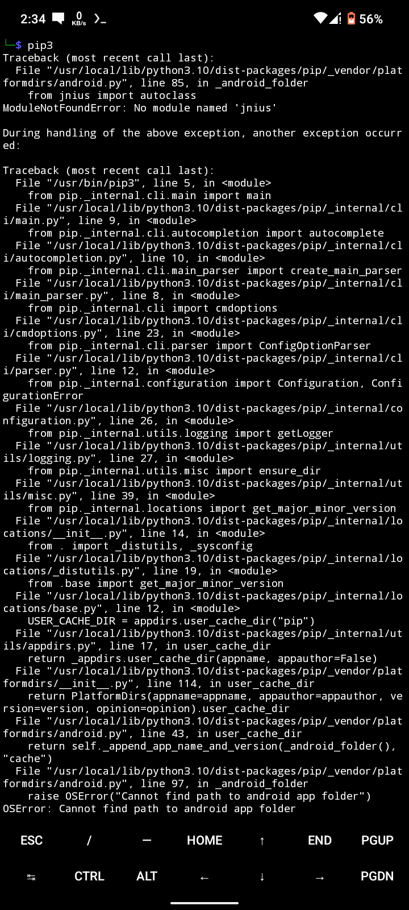

# fixpip3
This is a fixer script for Termux platformdirs error in pip3



**If you are facing this platformdirs issue while trying to run pip3 in proot-distro then run:-**
``` 
git clone https://github.com/bdhackers009/fixpip3
cd fixpip3
bash fix_pip.sh
``` 
**it will resolve the problem.**
**However this problem will be solved in the next update of platformdirs**

